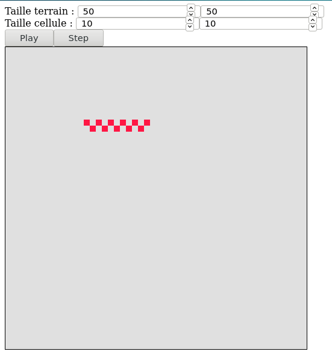
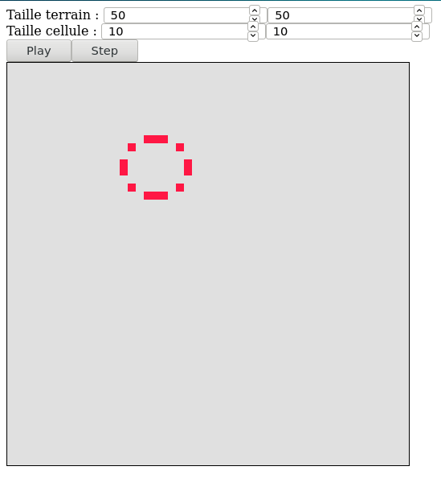

# Game of Life

Quick project for minimal game of life component





## How to use it

Declare in a module :

```
import { GameOfLifeModule } from 'c7z-game-of-life';

...

@NgModule({
  declarations: [
    ...
  ],
  imports: [
    ...
    GameOfLifeModule,
  ],
})
export class AppModule {
  ...
}

```

Declare in template :

```
<c7z-game-of-life #gameOfLife></c7z-game-of-life>
```

or  

```
<c7z-game-of-life #gameOfLife (changedStatus)="isPlaying($event)" [fieldWidth]="fieldWidth" [fieldHeight]="fieldHeight" [cellWidth]="cellWidth" [cellHeight]="cellHeight"></c7z-game-of-life>
```

Launch in component :

```

@ViewChild('gameOfLife') public gameOfLife: GameOfLifeComponent;
...

this.gameOfLife.togglePlay(); // Execute when you want to play
this.gameOfLife.getNextStep(); // Execute when you want to get next step
```

## Default values

Field size : 50 * 50  
Cell size : 10 * 10
